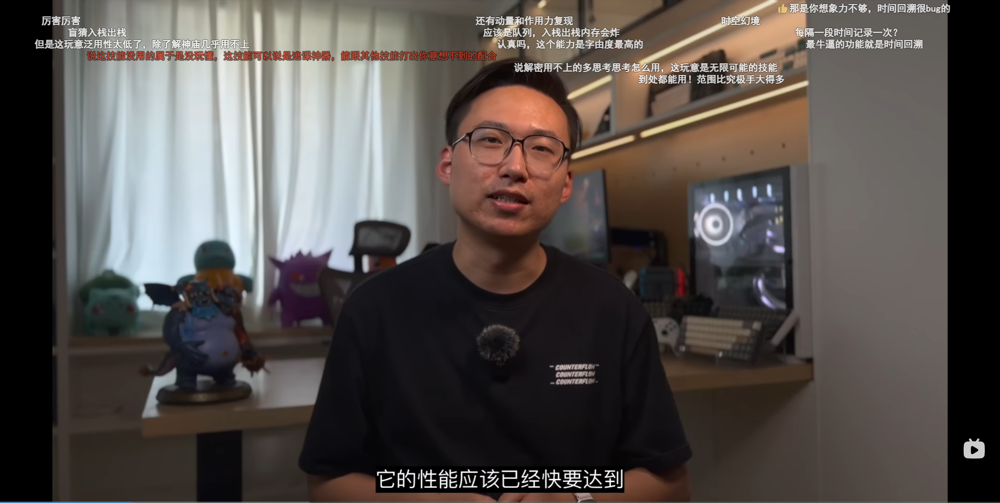
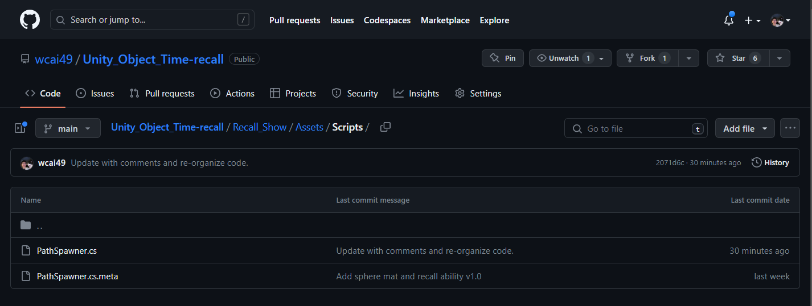
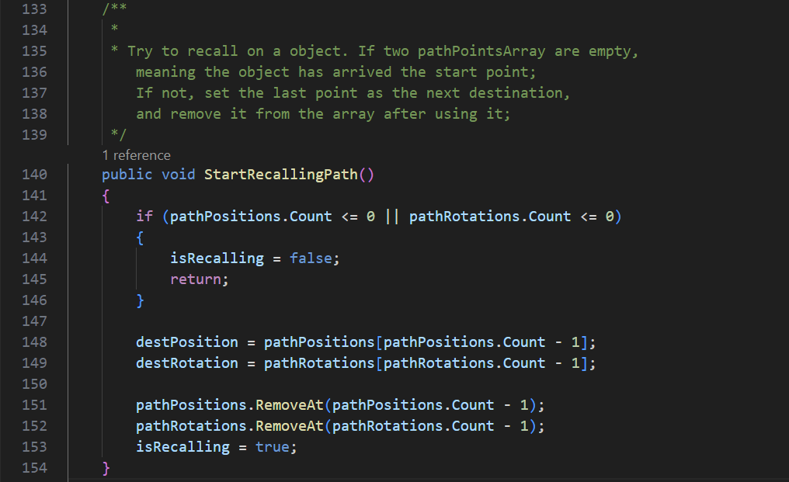
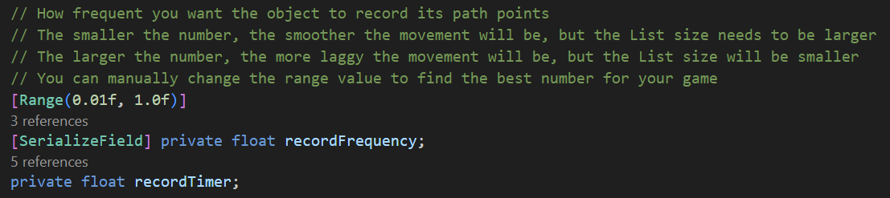

# Unity Object Time-recall: 'Zelda'-like
<p align="center">
    
    <div align="center"> 
        <p>What up gamers! Thanks all your supports from our last video. </p>
        <p>感谢所有观看过视频的玩家们，感谢你们的时间、点赞、投币、关注，让我的第一次视频尝试获得了超出预期的成果。</p>
    </div>
</p>

## Introduction

---

I have been played **The Legend of Zelda: Tears of the Kingdom** for weeks. I have been thinking about the ablity: Recall, which is a new feature in the game while I was playing the game. I think it is a good idea to implement this feature in Unity. So I made this project. 

If you want to apply this feature in your game, you can go through the readMe. It will take **less than 5 minutes** to finish the whole process.

If you think this helps you, please give me a star. Also, I am running my own channel on both Bilibili and Youtube, could be found in my [Github Home page](https://github.com/wcai49).

However, my content in short term will be all in Mandarin. If you hate to read on subtitles and would like to see me also making videos in English version, please leave comments anywhere you can find me. I will be very appreciated.

## How to use the project code

---

#### 1. Get the code

Basically, all you need is the C# code PathSpawner.cs under the this path

<p align="center">

</p>
In your Unity project Assets panel, create your Script and name it PathSpawner.cs. Then copy and paste the code in the file PathSpawner.cs in this repository.

If you want to name it differently, remember to change the class name in the code.

#### 2. Prepare the object you want to be recalled

If you want to recall a GameObject, here are the prerequisites:

- The GameObject must have a Rigidbody component, make sure isKinematic is not checked.
- The GameObject must have the C# Script you just created in the last step.

#### 3. Set up how you want to recall

Click on the object you prepared, in the Inspector panel, you will see the Path Spawner component

<p align="center">
 
</p>


- **Path Positions** will show the object's past position points. 

- **Dest Position** shows the next position the object will be recalled to. 

- **Path Rotations** will show the object's past rotation points.

- **Dest Rotation** shows the next rotation the object will be recalled to.

These are all private values, which means you **should not** change them during Playing mode; They are only for debugging.

#### 4. Let the recall begin

In the Path Spawner component, you will see a public function called **StartRecallingPath**. 
<p align="center">
 
</p>

You can call this function in your own script. For example, in the demo Scene, I assigned a Button click event to the function. You can also call it in your own script like below.

```c#
private void Update()
{
    if (Player want to recall)
    {
        GetComponent<PathSpawner>().StartRecallingPath();
    }
}
```

#### 5. Custom your recall for your own game

In the PathSpawner.cs, there are variables you can change to custom your recall.

Here are some examples:

<p align="center">
    
</p>

You can modify the record frequency. The default value I was using is 0.05f, which means the object will be recorded every 0.05 seconds. You can change it to 0.1f, which means the object will be recorded every 0.1 seconds. 

As it already mentioned in the comment: 

- The smaller the number is, the smoother the movement will be, but the List size needs to be larger because there will dramatically more points in the List. 
- The larger the number is, the more laggy the movement will be, but the List size will be smaller since there will be less points in the List during the certain time period.

## Future plan?

---

Currently, this solution is not perfect. For example, if the quantity of recallable objects is large, the performance has not been tested yet. Also, many awesome features that Nintendo has implemented in the game are not included in this solution, e.g., while the object is in recalling, the path with the object's illusion will be shown.

- If you tried my solution and found any bugs, please kindly point it out by adding issues in this repository. I will try my best to fix it.

- If you like the idea, and would like to contribute to this project, please enlist the repository, create your **own branch** by naming like below, then create a **pull request**.
```
[user]/[your name]/[feature name in short terms]

// For example,
user/wcai49/add-recall-path-illusion
```
My hope is to let this project be a community project, and we can make it convenient for every game developer to use and let their game be more fun.

- If you are looking forward to any new features, or just want to talk random stuffs about my project, my channel, or anything else, please feel free to contact me. I will be very appreciated. The email address will be found in my [Github Home page](https://github.com/wcai49).

Cheers!
